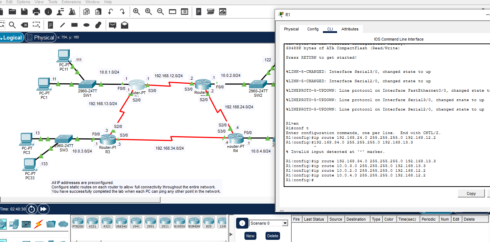
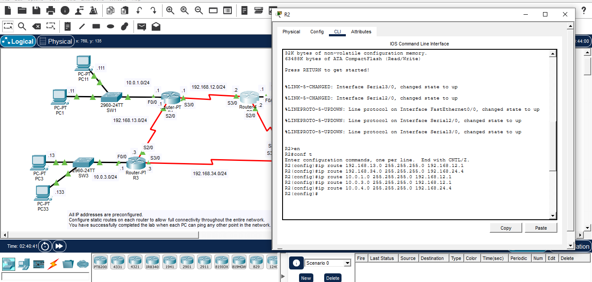
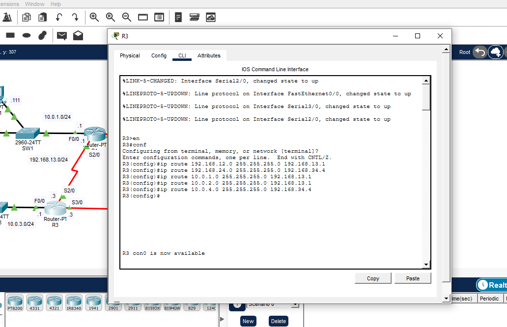
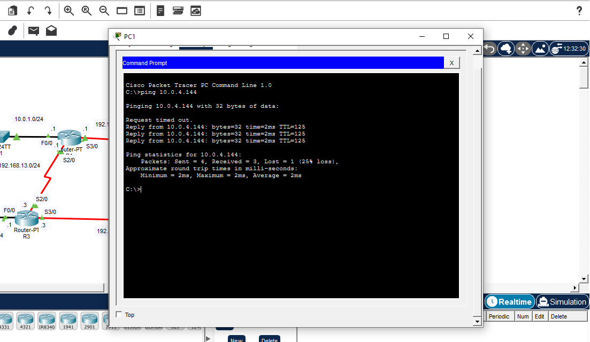
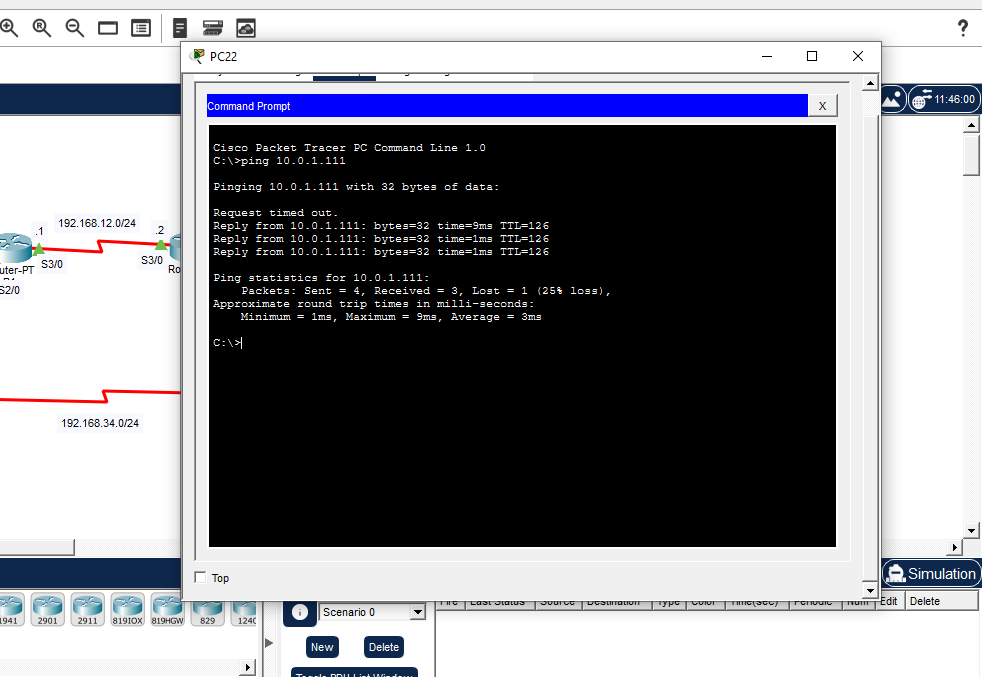
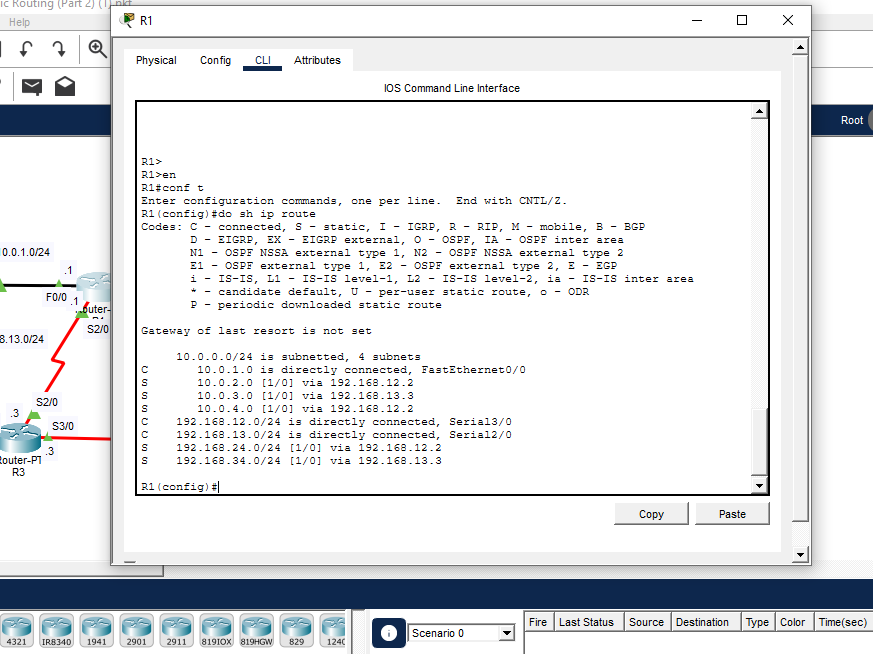
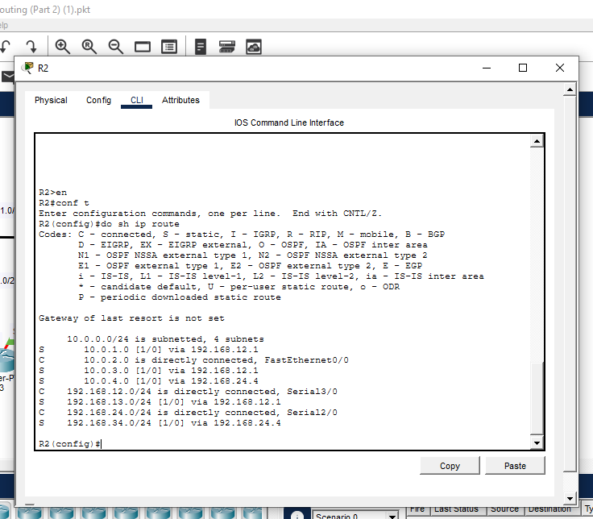
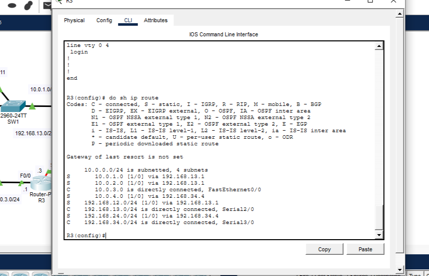
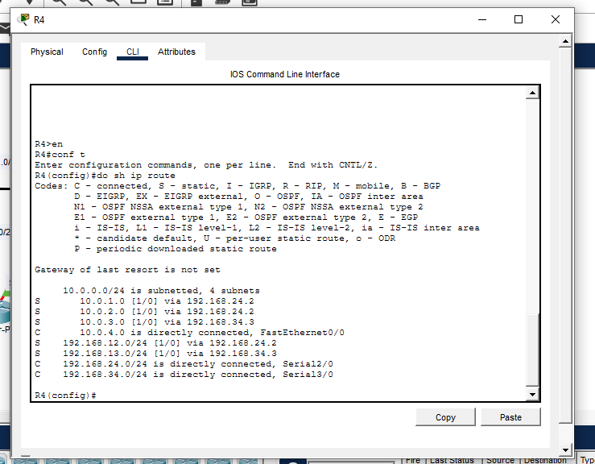

# Cisco Packet Tracer - Static Routing Lab

## 📖 Project Overview

This project demonstrates the implementation of **Static Routing** in Cisco Packet Tracer using four Cisco routers connected through serial links. Each router connects to its own Local Area Network (LAN), and static routes are manually configured to allow communication between all remote networks.

Unlike dynamic routing protocols such as RIP, OSPF, or EIGRP, this project uses **manual route configuration**, providing a deeper understanding of how routers forward packets across multiple networks.

---

# 🖥️ Network Topology


---

# 🎯 Objectives

- Configure IPv4 addressing on routers and PCs.
- Configure FastEthernet and Serial interfaces.
- Build a multi-router topology.
- Configure Static Routes on every router.
- Verify routing tables.
- Test end-to-end connectivity between all networks.
- Troubleshoot routing issues.

---

# 🛠️ Technologies Used

- Cisco Packet Tracer
- Cisco IOS CLI
- Static Routing
- IPv4 Addressing
- FastEthernet Interfaces
- Serial Interfaces
- ICMP (Ping)
- Routing Tables

---

# 🌐 Network Addressing

## LAN Networks

| Router | LAN Network |
|---------|-------------|
| R1 | 10.0.1.0/24 |
| R2 | 10.0.2.0/24 |
| R3 | 10.0.3.0/24 |
| R4 | 10.0.4.0/24 |

### WAN Networks

| Connection | Network |
|------------|---------|
| R1 ↔ R2 | 192.168.12.0/24 |
| R1 ↔ R3 | 192.168.13.0/24 |
| R2 ↔ R4 | 192.168.24.0/24 |
| R3 ↔ R4 | 192.168.34.0/24 |

---

# ⚙️ Configuration Tasks

### ✅ Configured IPv4 Addressing

- Router Interfaces
- Serial Interfaces
- FastEthernet Interfaces
- PCs
- Default Gateways

### ✅ Configured Static Routes

Each router was manually configured with static routes to all remote networks.

Example:

```bash
ip route 10.0.3.0 255.255.255.0 192.168.13.3
ip route 10.0.2.0 255.255.255.0 192.168.12.2
ip route 10.0.4.0 255.255.255.0 192.168.12.2
```




# 🔍 Verification

Routing tables were verified using:

```bash
show ip route
```

```bash
ping
```

---

Network connectivity was verified using:

```bash
ping
```

---

# 📷 Connectivity Tests

## PC1 → PC44



The first ping request timed out due to ARP resolution, while the remaining packets were successfully delivered, confirming proper routing.

---

## PC44 → PC33



Successful end-to-end communication between different LANs confirmed that the static routes were correctly configured.

---

## PC22 → PC11


Successful end-to-end communication between different LANs confirmed that the static routes were correctly configured.

---

# 📊 Routing Tables

## Router R1



---

## Router R2



---

## Router R3



---

## Router R4



---

# ✅ Skills Demonstrated

- Cisco IOS CLI
- Static Routing
- IPv4 Addressing
- LAN/WAN Networking
- Router Configuration
- Serial Interface Configuration
- FastEthernet Configuration
- Network Troubleshooting
- Routing Table Verification
- ICMP Testing
- End-to-End Connectivity Testing

---

# 📚 Learning Outcomes

Through this project, I gained practical experience in:

- Designing a multi-router network
- Configuring router interfaces
- Assigning IPv4 addresses
- Creating static routes
- Troubleshooting routing issues
- Testing network connectivity using ICMP
- Reading and interpreting routing tables

---

# 🚀 Future Improvements

- Implement RIP Routing
- Configure OSPF
- Configure EIGRP
- Add VLANs
- Configure Router-on-a-Stick
- Implement DHCP
- Add ACLs for traffic filtering
- Introduce NAT/PAT


---

# 👨‍💻 Author

**Chiemelie Isuma**

Network Operations Engineer | Cisco Networking | IT Support | Network Infrastructure

